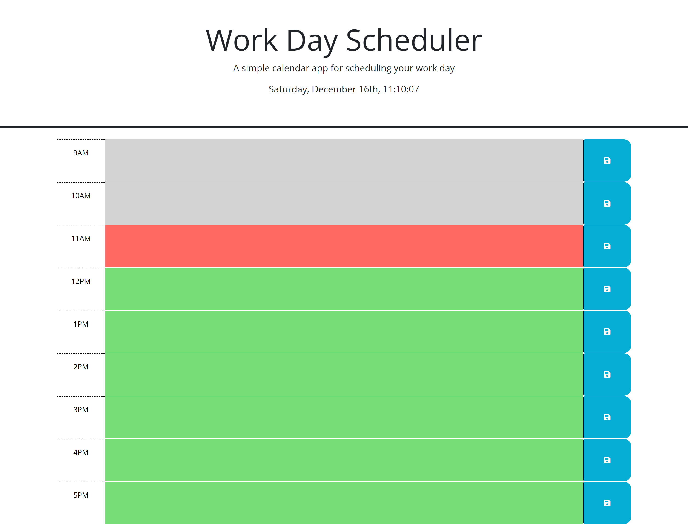

# JN-Work-Day-Scheduler


## Description

This challenge allowed me to create a scheduler for a 9AM to 5PM work day. This page includes some features such as showing the current day and time, color coding the time block based on the current time, as well as being able to save the user's input and rendering it on the page upon refresh. The challenge was completed by following the acceptance criterias listed below:


```md
GIVEN I am using a daily planner to create a schedule
WHEN I open the planner
THEN the current day is displayed at the top of the calendar
WHEN I scroll down
THEN I am presented with timeblocks for standard business hours of 9am and 5pm
WHEN I view the timeblocks for that day
THEN each timeblock is color coded to indicate whether it is in the past, present, or future
WHEN I click into a timeblock
THEN I can enter an event
WHEN I click the save button for that timeblock
THEN the text for that event is saved in local storage
WHEN I refresh the page
THEN the saved events persist
```

This project gave me the opportunity to learn more about third-party APIs. It was extremely interesting to see how the different APIs dynamically changed the page. I very much enjoyed the process of creating the page and seeing it come to life.


## Usage

This project provided starter HTML, CSS, and JavaScript codes. From there, I was able to alter and add to the code in order to fulfill the requirements. I was able to apply all of the things that were taught during class, and I was also able to add more functionality to the page by doing research and reading the documentations. 

The image below shows the final product:




## Credits

Thank you Corey Yates, Michael Hodges, and Andrew Bautista for all your help! 😊👍


## Links

GitHub Link: https://github.com/jkimys2/JN-Work-Day-Scheduler

Deployed Page: https://jkimys2.github.io/JN-Work-Day-Scheduler/